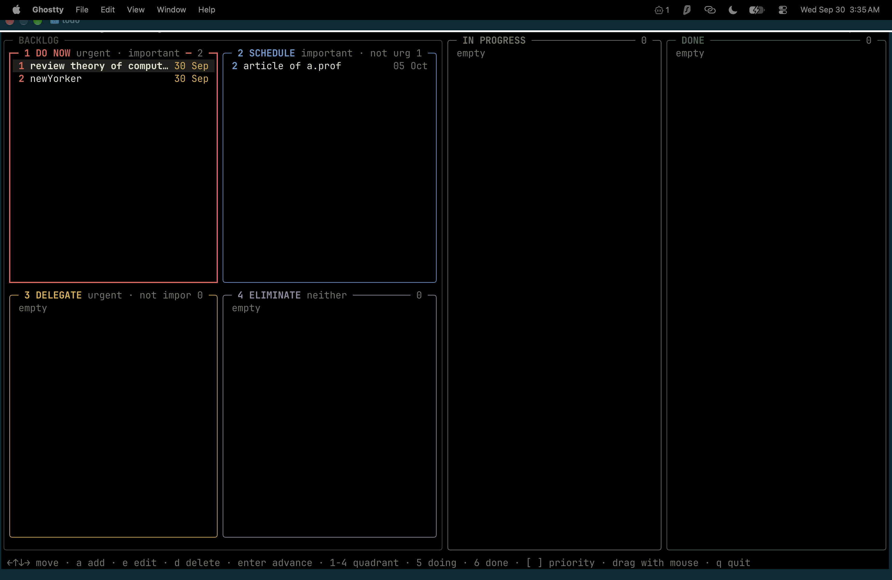

# kanban

Terminal Kanban board with an Eisenhower-matrix backlog. Go + Bubble Tea.



```
┌ BACKLOG ─────────────┐ ┌ IN PROGRESS ┐ ┌ DONE ┐
│ ┌ 1 DO NOW ┐┌ 2 ... ┐│ │             │ │      │
│ ┌ 3 DELEGATE ┐┌ 4 ..┐│ │             │ │      │
└──────────────────────┘ └─────────────┘ └──────┘
```

## Run

```sh
go mod tidy        # first time only (fetches dependencies)
make run           # or: go run ./cmd/kanban
make build         # → bin/kanban
make test
```

Tasks are stored in `~/.config/kanban-tui/tasks.json` (override with `-f path`).
Behind a restricted network, set `GOPROXY` to a mirror before `go mod tidy`.

## Keys

| Key | Action |
|---|---|
| `← ↑ ↓ →` / `h j k l` | move between tasks and boxes |
| `a` / `e` | add / edit task (title, deadline, priority, box) |
| `d` then `y` | delete |
| `enter` | advance: backlog → in progress → done |
| `1`–`4` / `5` / `6` | move to quadrant / in progress / done |
| `[` `]` | raise / lower priority number |
| mouse drag | drag a task into any box or column |
| `q` | quit |

Persian digits and Persian-layout letters work for all shortcuts.
Deadline input: `YYYY-MM-DD`, `MM-DD`, `+3` (days), `today`, `tomorrow`.
Within a box tasks sort by priority (1 first), then deadline.

## Layout

```
cmd/kanban/           entrypoint: flags, wiring
internal/domain/      Board, Task, Zone, deadline rules — no I/O, no UI
internal/storage/     domain.Repository implementation (atomic JSON file)
internal/ui/          Bubble Tea front-end
  model.go            state + Update dispatch
  input.go            keyboard + mouse (drag & drop)
  form.go             add/edit dialog
  view.go             rendering of header, zones, status
  canvas.go layout.go cell-grid renderer + hit-testing geometry
  theme.go keymap.go  palette; Persian key aliases
```

Dependencies point inward: `ui → domain ← storage`. The UI only sees the
`domain.Repository` interface, so it is tested with an in-memory fake.

To rename the module: `go mod edit -module github.com/you/kanban` and
`grep -rl '"kanban/' . | xargs sed -i 's#"kanban/#"github.com/you/kanban/#'`.


also for comfort I added scripts/install.sh and by running sh install.sh or ./install.sh you can access todo from any directory you would please!
